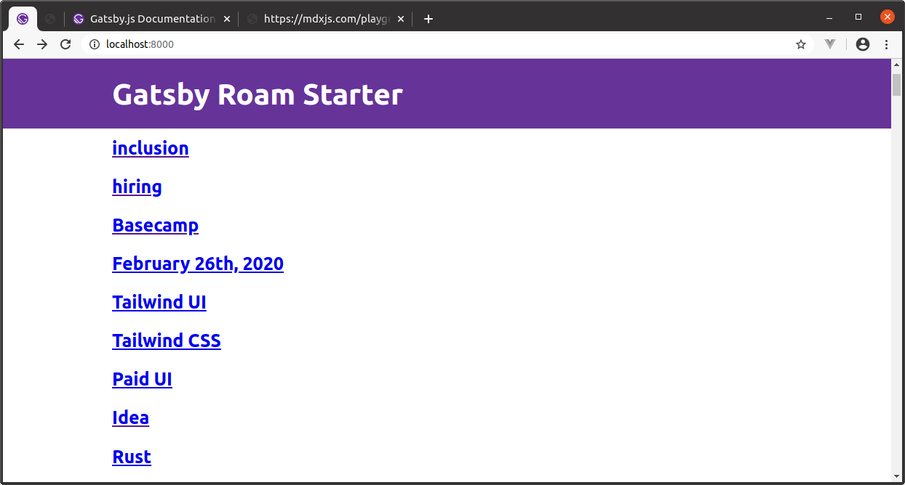

# Gatsby Starter for Roam
[](https://mobile.twitter.com/heyjoshwood)

A [GatsbyJS](https://www.gatsbyjs.org/) starter for your [Roam Research](https://roamresearch.com/) database.



This project is in the early stages of development.
- [Here are my notes](./NOTES.md).
- [PRs welcome](https://github.com/joshuap/gatsby-starter-roam/pulls).

## Getting Started

1. Install the starter:

    ```sh
    gatsby new gatsby-roam https://github.com/joshuap/gatsby-starter-roam/
    ```

2. Change directory:

    ```sh
    cd gatsby-roam
    ```

3. Export your database in Roam and import it into your project:
    1. Go to https://roamresearch.com/#/app/yourdb -> Export All
        1. Select JSON as the export format
    2. Save export JSON file to `db/roam.json`

4. Run the development server:

    ```sh
    gatsby develop
    ```
    Your site should be running at http://localhost:8000

## License

This project is MIT licensed. See the [LICENSE](https://github.com/joshuap/gatsby-starter-roam/blob/master/LICENSE) file in this repository for details.
